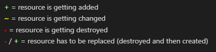

# Deploy infrastructure in AWS with Terraform

This the final project for the Technische Berufsschule Zürich (TBZ) "Cloud-native, DevOps & Container" bootcamp.

In this project I will try to create and deploy an AWS infrastructure with Terraform.

I want to create 2 VMs in the same VPC but in 2 different subnets. Each VM will run a webserver. To configure the webservers, I will use a S3 bucket, which will hold the webserver configuration.
# Prerequesites
* [AWS Account](https://aws.amazon.com/free/?all-free-tier.sort-by=item.additionalFields.SortRank&all-free-tier.sort-order=asc&awsf.Free%20Tier%20Types=*all&awsf.Free%20Tier%20Categories=*all)
* [Visual Studio Code](https://code.visualstudio.com/download)
* Windows 10 / 11*

*This documentation was written with a computer running windows, however it can still be done with MacOS or Linux. You have to use the corresponding installer for your OS and adding the binaries and variables in your OS environment.
    
# Setup CLI Tools

## Install AWS CLI
1. Open Powershell or cmd.exe and enter the following command:  
`msiexec.exe /i https://awscli.amazonaws.com/AWSCLIV2.msi`  

An AWS Installer will appear  

2. Click **Next**

Read and accept the license agreement and follow the steps in the installer. The default settings will work.

Re-open a powershell or cmd.exe and enter the command `aws --version` to check for the current version and if the installation worked.

## Install Terraform
1. Download the Terraform executable from the official HashiCorp website for your system:  
https://developer.hashicorp.com/terraform/downloads  

2. Create a directory for storing the terraform executable.  
I created my folder named Terraform under the following path: **C:\HashiCorp\Terraform**

3. Move the downloaded executable in this directory
  

4. Add this directory path to the PATH environment variable   

5. Click OK to apply all changes.

Terraform should now correctly be installed. Open Powershell or cmd.exe and check for the terraform version with the command `terraform version`  

# Add Terraform extension in VS Code
To get help with syntax validation or code formatting it is strongly recommended to install the terraform extension for visual studio code.

The extension is called "HashiCorp Terraform" and can be found in the Visual Studio Code Marketplace through the Extensions Tab.  

  
The extension can also be downloaded directly through this link:
https://marketplace.visualstudio.com/items?itemName=HashiCorp.terraform

# Create an AWS Access Key
So that Terraform is able to provision things an access ID and a secret access key is required.

1. Open and login into the AWS management console
2. Navigate to the **Identity and Acces Management (IAM)** service
3. Click on **Add users**
4. Define a User name, I used terraform-demo. Also very important to  
Enable **Access key - Programmatic access**

5. Click **Next: Permissions**
6. Choose **AtTach existing policies directly** and select **Administrator Access**
7. Click **Next: Tags**
8. Click **Next: Review**
9. Click **Create user**
10. Save the credentials (Access key ID & Secret access key)

**The keys won't be reviewable after this step, so it is important to note them down and save them in a secure place!**

11. Click **Close**
# Setup AWS Profile

From now on everything will be done in the VS Code Terminal.

1. Open the VS Code Terminal
2. Enter the command `aws configure --profile <profile-name>`  
I will use the profile name "tbz-project"
3. Enter the **Access key ID & Secret access key** (see the chapter above)
4. Enter **us-east-1** for the default region
5. Press Enter to let the default output format stay on [None]  

6. On Windows enter the command `$env:AWS_PROFILE="tbz-project"`  
on Linux or MacOS you can use `export AWS_PROFILE=tbz-project`

# Terraform infrastructure configuration
## Provider Registry
Terraform has a website with documentations for most cloud providers and how to deploy their resources using terraform.

URL: https://registry.terraform.io/

For provisioning infrastructure in AWS a provider block has to be specified in the beginning of the configuration.

In the documentation it's showing us already how to use the provider block  

this configuration block can be copy & pasted in a terraform file ending with .tf for example in a file called main.tf or provider.tf.

This can be done for all the other resources (VMs, VPCs, Subnets, Security gropus etc.)  
Every resource should have a documentation with an example configuration that can be used and adjusted.

## My Configuration

I created a directory called [infrastructrue](https://github.com/k-milic/deploy-infrastructure-with-terraform/blob/main/infrastructure) and placed all my configuration files in there.
For security reasons I also added an .gitignore file, so my local state file and my lock file won't be submitted in this repository.

### Terraform files
[providers.tf](https://github.com/k-milic/deploy-infrastructure-with-terraform/blob/main/infrastructure/providers.tf)

[network.tf](https://github.com/k-milic/deploy-infrastructure-with-terraform/blob/main/infrastructure/network.tf)

[instances.tf](https://github.com/k-milic/deploy-infrastructure-with-terraform/blob/main/infrastructure/instances.tf)

[s3.tf](https://github.com/k-milic/deploy-infrastructure-with-terraform/blob/main/infrastructure/s3.tf)

[loadbalancer.tf](https://github.com/k-milic/deploy-infrastructure-with-terraform/blob/main/infrastructure/loadbalancer.tf)

[locals.tf](https://github.com/k-milic/deploy-infrastructure-with-terraform/blob/main/infrastructure/locals.tf)

[variables.tf](https://github.com/k-milic/deploy-infrastructure-with-terraform/blob/main/infrastructure/variables.tf)

[outputs.tf](https://github.com/k-milic/deploy-infrastructure-with-terraform/blob/main/infrastructure/outputs.tf)

### Website file
[/website/index.html](https://github.com/k-milic/deploy-infrastructure-with-terraform/blob/main/infrastructure/website/index.html)

# Deploying terraform infrastructure

## Terraform init
After creating a terraform directory and terraform configuration files you can run the command `terraform init` to initialize the provider plugins and the backend for the terraform state file.  

## Terraform fmt
Running the command `terraform fmt` will format the congifuration to comply with the HCL formatting. This command is pretty much unnecessary if the HashiCorp Terraform extension for VC Code mentioned above is installed. The extension is already taking care of the formatting if the file gets saved.

## Terraform validate
The command `terraform validate` is checking if the congifuration is valid. It checks if the configuration makes sense and if all necessary informations are provided in the configuration and if the syntaxes and data types are correct.  

If ther configuration is not valid, it will show where the error was found and what the possible error might be.

Here it was looking for a string and I didn't use "" around ***tcp*** to specify it as a string.

If the configuration is valid, it should give out following message:  

## Terraform plan
If the configuration is valid then the command `terraform plan` can be run. This command will compare the state file (what terraform thinks is deployed) to what is getting deployed with the configuration.  
Because right now nothing is deployed and the state file is empty, it will show everything with a green + Symbol because everything is getting added.

Here is a short explanation of what the operator mean:  

**+** = resource is getting added  
**~**     = resource is getting changed  
**-**        = resource is getting destroyed  
**-** / **+** = resource has to replaced (destroyed and then created)

## Terraform apply
To actual deploy the configuration the command `terraform apply` must be run.

# Best practice

It is best practice to run the command `terraform plan -out <name>.tfplan` first, so the changes are getting put out in a file, which later can be applied with the command `terraform apply <name>.tfplan`

# Testing
## Reflection